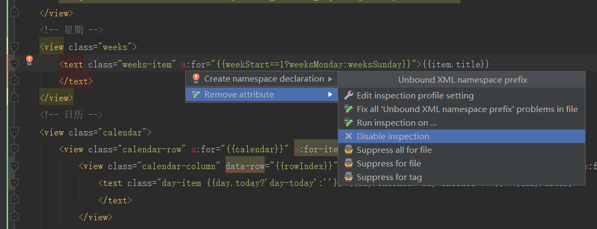
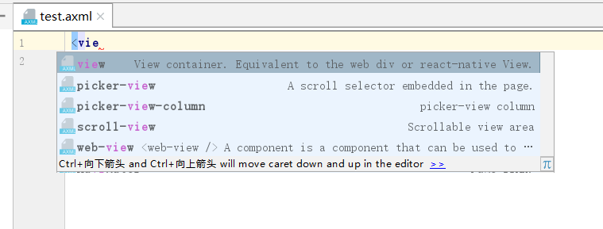
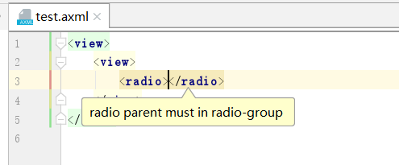
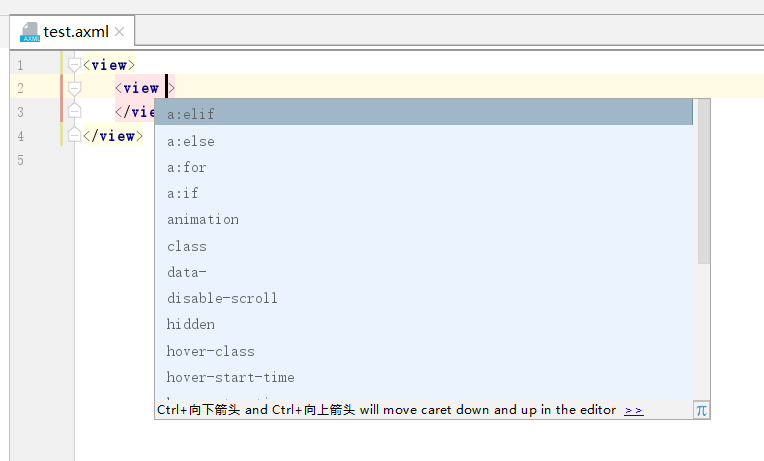
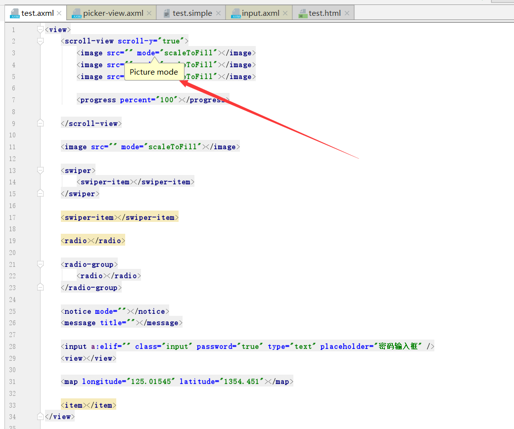
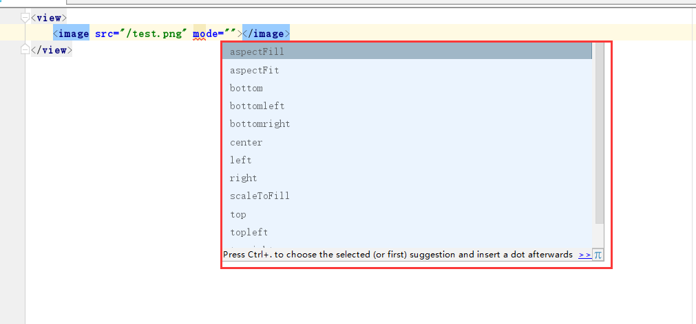
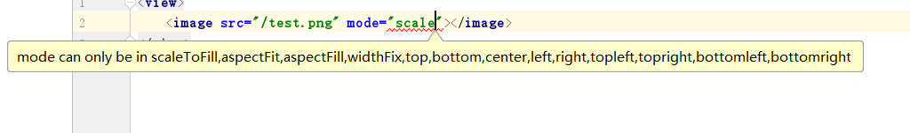

1.如何使用  
[下载插件](https://plugins.jetbrains.com/plugin/11332-axml-of-dingtalk)或者Setting->plugins->search(暂不支持)

*这个错误暂时还没找到解决办法, 所以我都是去掉这个提示, 并不影响使用*

2.特色
- 标签提示

- 标签验证

- 属性提示

- 属性描述

- 属性枚举

- 属性验证

3.扩展支持微信小程序?  
做这个插件主要是为了钉钉的E应用, 发现和微信小程序很相似, 扩展一下的话可以支持微信小程序, 但是我没有时间就不进行扩展了, 将来如果做微信小程序的话才会进行扩展吧

4.这个插件还存在问题, 毕竟时间有限, 项目比较急, 工欲善其事, 必先利其器  
*做这个插件大概用了3-4天吧, 主要是tag的json文件花了一整天时间, 属性标签太多了, 意外的替换导致所有空格没了, 很影响阅读, 有重新进行了编辑*  
*有问题可以提issues, 我看到了会及时修改, 谢谢*